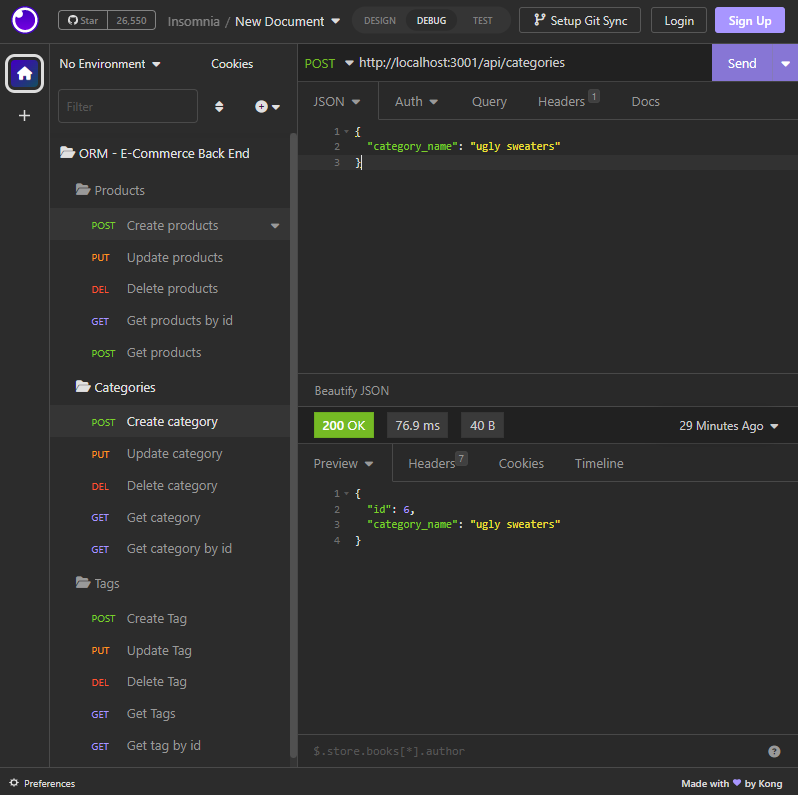
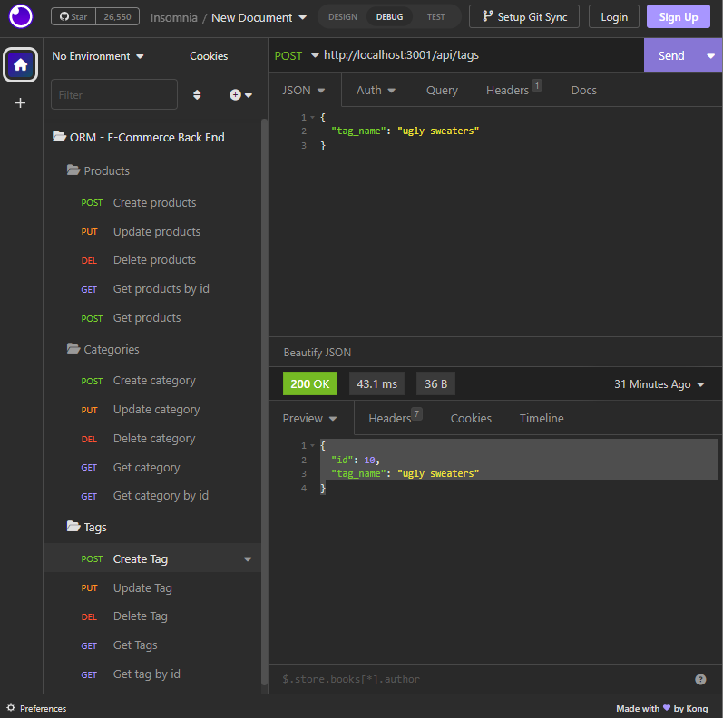
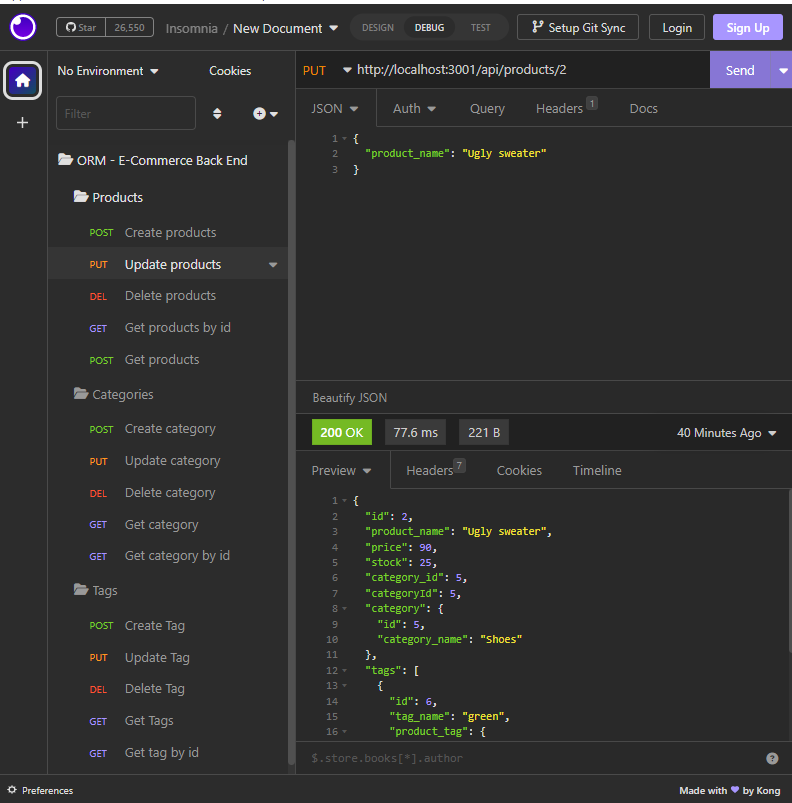

# ORM-E-Commerce-Back-End

**ORM E-Commerce Back End** is an application built using JS, MySQL, Sequelize, Json, insomnia, prettier, express and node.js.


## Images of the deployed website:
***

## Create a Category


## Create a Tag


## Delete a Tag



## User Story

```md
AS A manager at an internet retail company
I WANT a back end for my e-commerce website that uses the latest technologies
SO THAT my company can compete with other e-commerce companies
```

## Acceptance Criteria

```md
GIVEN a functional Express.js API
WHEN I add my database name, MySQL username, and MySQL password to an environment variable file
THEN I am able to connect to a database using Sequelize
WHEN I enter schema and seed commands
THEN a development database is created and is seeded with test data
WHEN I enter the command to invoke the application
THEN my server is started and the Sequelize models are synced to the MySQL database
WHEN I open API GET routes in Insomnia for categories, products, or tags
THEN the data for each of these routes is displayed in a formatted JSON
WHEN I test API POST, PUT, and DELETE routes in Insomnia
THEN I am able to successfully create, update, and delete data in my database
```

  ***
  
  Features of the deployed application and repository are as follows:

  ## TECHNOLOGY USED
  *** 
    JS 
    MySQL
    Seqealize
    Json 
    express 
    node.js
    insomnia
    prettier
 

## THE DEPLOYED REPO CAN BE FOUND AT THE FOLLOWING URL:
***
[Click here to view the deployed repo](https://github.com/Lycanchic/ORM-E-Commerce-Back-End)

## Video Walkthrough:


[Click here to view the walkthrough video!](https://drive.google.com/file/d/1UHMoHGne4J5fXmUnzjxKFYSf0hNSc9Hm/view)

  ## INSTALLATION OF THE REPO FROM GITHUB
  ***
  A copy of the repository can be cloned at [click here for the Github Repo](https://github.com/Lycanchic/ORM-E-Commerce-Back-End). 
    * Simply click on the repo and select **Clone**. 
    * From the drop down menu select the copy icon. Type (directly into your terminal):
    ```
    'git clone' + 'the repo link' + enter.
     
<br>

- - -
© 2022 Trilogy Education Services, LLC, a 2U, Inc. brand. Confidential and Proprietary. All Rights Rese